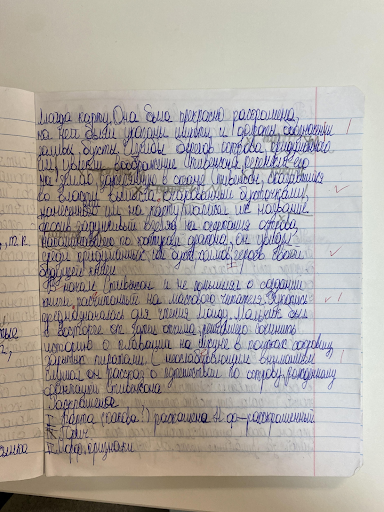
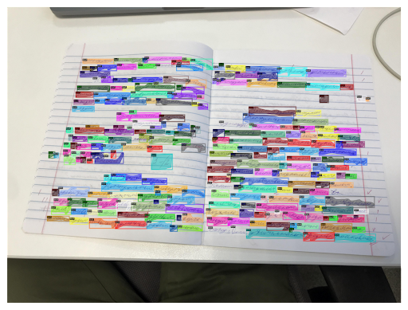

# Telegram bot for handwritten text recognition

## Install

To install you must have:

- ```GNU/Linux```
- ```python3.9```
- ```g++```

### Poerty

``` bash
curl -sSL https://install.python-poetry.org | python3 - --preview
export PATH="/home/$USER/.local/bin:$PATH"
```

### NoteScribe

``` bash
git clone --recursive https://github.com/naereni/NoteScribe.git
cd NoteScribe && sh install.sh
```

If you will you encounter a problem with ctcdecode - you should run several times ```python setup.py install``` in directory **NoteScribe/third_party/ctcdecode**

## Solution

### What the problem?

> This task is from National Tech Olympiad (NTO). Problem is get all text from photo of school notebook. The text can be in russian or in english.

### How this work?

> A sequence of two models: segmentation and recognition. First, the segmentation model predicts the mask polygons of each word in the photo. Then these words are cut out of the image along the contour of the mask (drops are obtained for each word) and fed into the recognition model. The result is a list of recognized words with their coordinates.

### Models

**Instance Segmentation**
[](https://colab.research.google.com/github/naereni/NoteScribe/blob/main/train/detectron2_segmentation_latest.ipynb)

- [X101-FPN](https://github.com/facebookresearch/detectron2/blob/main/MODEL_ZOO.md#coco-instance-segmentation-baselines-with-mask-r-cnn) from detectron2.model_zoo + augmentation + high resolution

**Character Recognition**
[](https://colab.research.google.com/github/naereni/NoteScribe/blob/main/train/ocr_model.ipynb)

- CRNN architecture with Resnet-34 backbone and BiLSTM, pre-trained for the top 1 models of the competition [Digital Peter](https://github.com/sberbank-ai/digital_peter_aij2020)

**Beam Search**
[](https://colab.research.google.com/github/naereni/NoteScribe/blob/main/train/make_kenlm_dataset_latest.ipynb)

- [KenLM](https://github.com/kpu/kenlm), trained on competition data [Feedback](https://www.kaggle.com/c/feedback-prize-2021/data ), **"Решу ОГЭ/ЕГЭ"**, and also [CTCDecoder](https://github.com/parlance/ctcdecode)

### Resources

**Christofari** with **NVIDIA Tesla V100** and docker image **jupyter-cuda10.1-tf2.3.0-pt1.6.0-gpu:0.0.82**

## Implementation

### About

In this telegram project, the bot was written using the aiogram library, that is, it supported synchronous I/O, as well as the model itself, in other words, each subsequent user who launched the bot does not increase the task execution time of the previous user.

### How to start

In this project, implementation is telegram bot. Realization is containing in `./src`. To start bot you have to run `./src/server.py`, and for security reasons, API key must contain in environment variables. Like a `export TG_API_TOKEN="123"`.

### Examples
|||
|-|-|
|||
